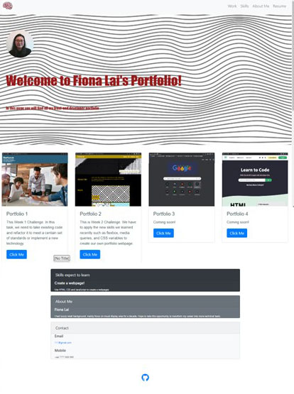

# Bootstrap-Portfolio

## Description

In this chanllenge, we have to modify our last week challenge by using the new skills we learn from this week such as, Bootstrap CSS framework, plus the material we learned, such as HTML, CSS, Github, Github pages.

We learn to use the Bootstrap to build the CSS framework in the pages, and i solve some image size problem to make it more tidy, also the icon placement problem that i input the link in the header.

## Table of contents
- [Installation](#installation)
- [Usage](#usage)
- [Credits](#credits)
- [License](#license)

## Installation

First, i read the instruction, create the file system and start to build the HTML file. Secondly, i prepared the required images and solve the CSS files. At last, upload all the work to GitHub and submit the assignment.

## Usage
Open Web page and navigate to the projcects section by scrolling, or by clicking projects in the navbar. Click the link to view the project that is of interest to have it open in a new tab. 

<a href="https://fitzfinoo.github.io/Bootstrap-Portfolio/"> Live Link </a>

<a href="hhttps://github.com/Fitzfinoo/Bootstrap-Portfolio/settings/pages"> Respo Link </a>

## Credits

Thanks to edx bootcamp team for providing starter code and mockup.

## License
MIT License

Copyright (c) 2022 Fitzfinoo

